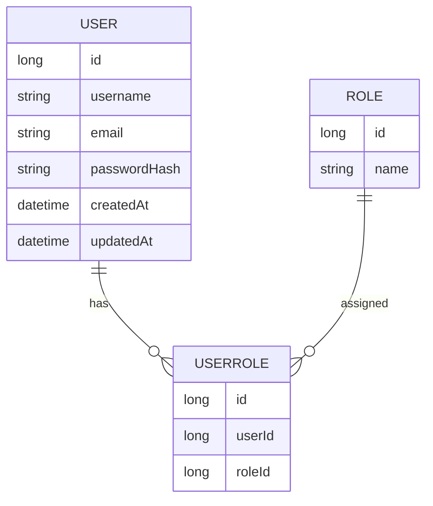
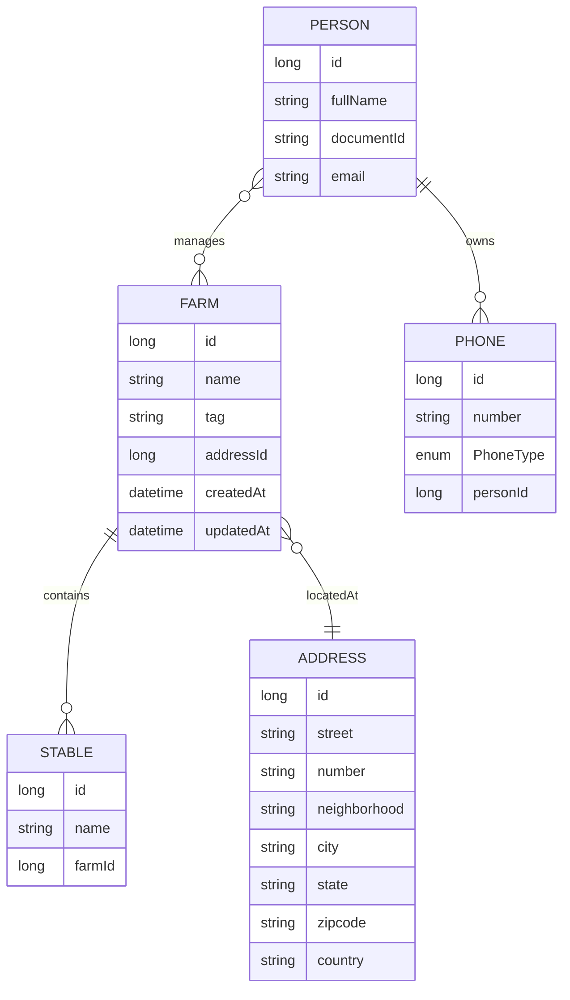
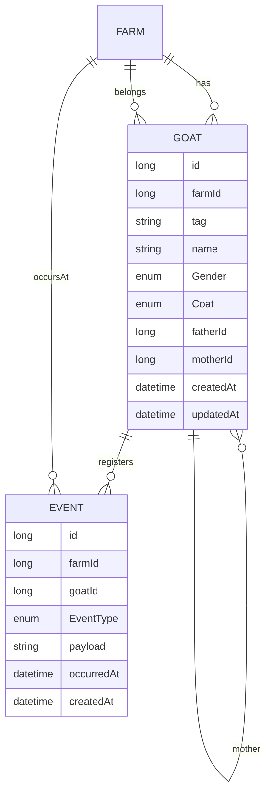

# 🧩 ERD — Diagramas em Mermaid

> Visualização do modelo de dados do CapriGestor dividida em três partes para leitura mais clara. Estes blocos são compatíveis com GitHub e extensões de Markdown com suporte a Mermaid.

## 1) RBAC (Usuários, Roles)

## 2) Fazenda e Contato

## 3) Animais e Eventos

---

Para um panorama único, consulte também o diagrama integrado no `README.md`.